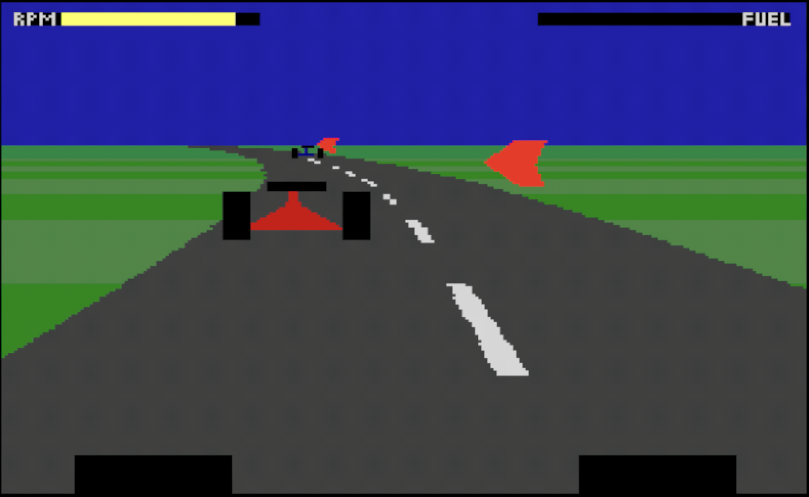

# VectorDream

A currently-unnamed driving game for the SAM Coupé based on a novel* span-buffer algorithm; the display is built up in RLE form and then only differences between it and the previous are plotted.

\* programs for the SAM Coupé are so rare as to make almost everything novel.

## Introduction to the SAM Coupé

A 1989 machine, the SAM Coupé has a Z80 processor and, in its most-native modes, a 24kb frame buffer of 256x192 pixels at 4bpp.

Although the Z80 is nominally rated at 6Mhz each full frame breaks down into two regions:
* the area with pixels, occupying 256/384ths of a line for 192/312ths of the display (i.e ~41% of the frame), in which the processor gets a memory access slot only once every 8 cycles; and
* the rest of the frame (i.e. the remaining ~59%) in which the processor gets a memory access slot once every 4 cycles.

This scheme is similar enough to the Amstrad CPC to make that a good point of comparison; in approximate terms the SAM runs:
* about 75% as fast as a CPC ~41% of the time; and
* about 150% as fast as a CPC for the other ~59%.

i.e. as a rule of thumb, it is about 20% faster than a CPC. But its frame buffer is aboput 50% larger than the one used by the CPC firmware (i.e. 80 bytes per line, 200 lines) and 100% larger than the one used by many CPC games (i.e. 64 bytes per line, 192 lines, so that logic is directly shared with the ZX Spectrum).

Unlike the CPC, the SAM Coupé uses a fixed size and fixed addressing for its frame buffer. No hardware support is available for any kind of scrolling, whether coarse or fine, and no relevant hardware tricks have been discovered.

On the other side, the SAM has a very large pool of memory for a Z80-based machine; the base hardware provides 256kb and a cheap, internal upgrade path to 512kb.

**Summary:** the SAM has about 20% more processing capacity than a CPC. It has about 100% more work to do. However it has two-to-eight times as much RAM.

## The SAM Coupé route to solid vector graphics

This repository attempts to use the comparatively-vast memory pool to ameliorate for the slow CPU. Graphics are composed in a span buffer; differences between the current and the previous span buffer dictate pixels plotted.

Although it can dip slightly below 10fps, it generally hangs out in the 20s.

